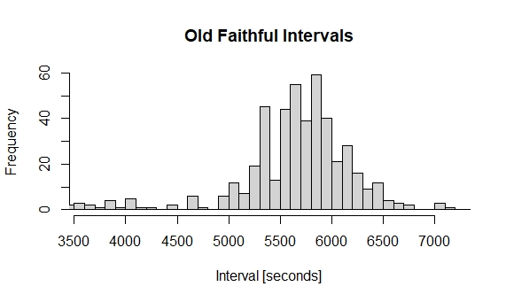

# GeyserTimes R Package

This repository contains the official GeyserTimes R package. It is designed to facilitate easy access to the data hosted at [GeyserTimes](https://geysertimes.org) using the R language. It primarily targets researchers and supports the following functionality.

* [x] Download and use the [GeyserTimes Archive](https://geysertimes.org/archive/) as a tidyverse tibble.
* [ ] Preview locations of geysers on a map (work in progress, see Issue #7).

### Installation

The easiest and quickest way to get started is to install this package directly from GitHub. At this stage, we haven't uploaded it to CRAN yet.
```r
# install.packages("devtools")
devtools::install_github("geysertimes/geysertimes-r-package")
```

### Quick Start

Here's a quick examle to get you going. We'll be plotting a very simple histogram of the last 500 eruptions of Old Faithful. First, we need to download and retrieve the archive data, which will be installed at the path given by `gt_path()`.
```r
library(geysertimes)
gt_get_data(path = gt_path()) # Download the data
eruptions <- gt_load_data() # Load the tibble
```

At this point, we have the full archive of eruptions. We first filter it to only contain Old Faithful eruptions that are primary. Then, we sort it descending by eruption time and add the interval column as the time difference between two subsequent rows.
```r
# install.packages("tidyverse")
library(dplyr)
oldfaithful <- filter(eruptions, geyser == "Old Faithful") # Filter Old Faithful
oldfaithful <- filter(eruptions, erution_id == primary_id) # Filter primary
oldfaithful <- arrange(oldfaithful, desc(time)) # Sort by time
oldfaithful <- mutate(oldfaithful, interval = lag(time) - time) # Add interval column
```
Finally, we'll take the last 500 intervals and plot this with R's built-in histogram functionality. Note that you can likely achieve better-looking charts, this is for demonstration only.
```r
last500 <- slice(oldfaithful, 2:101)
hist(as.numeric(last500$interval), breaks = 250, main = "Old Faithful Intervals", xlab = "Interval [seconds]", xlim = c(3600, 7200))
```

